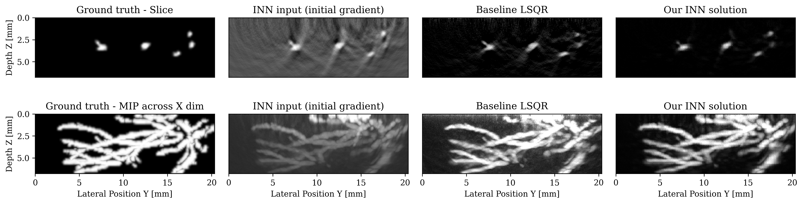

<!--- runninghead: INNs for 3D Photoacoustic Imaging

author:
- name: Rafael Orozco
  email: rorozco@gatech.edu
  affiliation: Georgia Institute of Technology
- name: Mathias Louboutin
  email: mlouboutin3@gatech.edu
  affiliation: Georgia Institute of Technology
- name: Felix J. Herrmann
  email: felix.herrmann@gatech.edu
  affiliation: Georgia Institute of Technology
-->

## Abstract:

Photoacoustic imaging (PAI) can image high-resolution structures of clinical interest such as vascularity in cancerous tumor monitoring. When imaging human subjects, geometric restrictions force limited-view data retrieval causing imaging artifacts. Iterative physical model based approaches reduce artifacts but require prohibitively time consuming PDE solves. Machine learning (ML) has accelerated PAI by combining physical models and learned networks. However, the depth and overall power of ML methods is limited by memory intensive training. We propose using invertible neural networks (INNs) to alleviate memory pressure. We demonstrate INNs can image 3D photoacoustic volumes in the setting of limited-view, noisy, and subsampled data. The frugal constant memory usage of INNs enables us to train an arbitrary depth of learned layers on a consumer GPU with 16GB RAM. 

## Problem Statement

In this work, we address the inverse problem of PAI given data $y$. This data is modeled with a linear forward model $A$ which describes the propagation of a spatially varying initial acoustic wavefield $x$.

```math #eq:problem

y = Ax + \varepsilon \, \, \, \, \text{with} \, \, \, \, \varepsilon \sim \mathcal{N}(0,\sigma^2 I)

```

<!--- In simple scenarios (most importantly full-view data), this problem is well-defined and has an analytical solution. However, -->
We tackle here the realistic case of limited-view, noisy and subsampled data, which makes the inverse problem ill-posed. Multiple solutions $x$ can explain the data $y$, therefore, this problem is typically solved in a variational framework where prior knowledge of the solution is incorporated by solving the minimization of the combination of an $\ell_2$ data misfit $L$ and a regularization term $p_{\mathrm{prior}}(x)$. The success of this formulation hinges on users carefully selecting hyperparameters by hand such as the optimization step length and the prior itself, typically a multipurpose generic prior such as TV norm. On the other hand, recent machine learning work argues that we can learn the optimal step length and even a prior. We pursue this avenue but select loop-unrolled networks since this learned method also leverages the known physics of the problem encoded in the model $A$. 


## Methods

### Loop-unrolled Networks:
@hauptmann2018model showed that known physical models can be combined with learned networks by using loop-unrolled networks. These networks emulate gradient descent where the $i^{\text{th}}$ update is reformulated as the output of a learned network $\Lambda_{\theta_{i}}$:

```math #eq:learnedgd

x_{i+1}, s_{i+1} = \Lambda_{\theta_{i}}(x_{i},s_{i}, \nabla_{x}L(A,x_{i},y))

```

where $s$ is a memory variable and $\nabla_{x}L$ is the gradient w.r.t the data misfit on observed data $y$. In our PAI case, $A$ is a linear operator (discrete wave equation) and $L$ is $\ell_2$ norm data misfit so the desired gradient is $\nabla_{x}L(A,x_{i},y) = A^{\top}(Ax_{i}-y)$. Thus, each gradient will require two PDE solves: one forward and one adjoint. These wave propagations embed the known physical model into the learned approach. @hauptmann2018model show that this method gives promising results on 3D PAI but note that they are limited to training shallow networks due to memory constraints. To improve on this method, we propose using an INN that is an invertible version of loop-unrolled networks.

### Invertible Neural Networks:
Our invertible neural network (INN) is based on the work of [@putzky2019rim]\, where they propose an invertible loop-unrolled method called invertible Recurrent Inference Machine (i-RIM). While typical loop-unrolled approaches have linear memory growth in depth @hauptmann2018model, i-RIM has constant memory usage due to its invertible layers. A network constructed with invertible layers does not need to save intermediate activations thus trading computation cost required to recompute activations for extremely frugal memory usage. The memory gains allowed i-RIM authors to train a 480 layer model which was the state-of-the-art for the FASTMRI challenge when published \cite{putzky2019rim}. For this work, we adapt i-RIM to Julia and make our code available alongside other invertible neural networks at \href{https://github.com/slimgroup/InvertibleNetworks.jl}{InvertibleNetworks.jl}  @witte2020invertiblenetworks\.


## Experiments and Results:

### Generating training dataset:
We perform supervised training on ground truth photoacoustic volumes taken from the blood vessels dataset of \cite{bench2020toward}. For each 3D volume, we simulate photoacoustic data by forward propagating an initial source at the vessels and restricting the wavefield to a planar array of receivers at the top of the volume.  We then subsample this data by a factor of 4 and add 10dB SNR Gaussian noise. For wave propagation, we use Devito a highly optimized DSL @louboutin2019devito combined with JUDI @witte2019large. Propagating a wavefield of $10^9$ voxels (100x300x300 volume for 1000 time steps) takes 35 seconds on a 4 core Intel Skylake CPU. 
<!--- %The adjoint propagation takes a similar time so a gradient calculation takes 80 seconds. Although comparatively low to other wave propagation software, this is long enough to prohibit the online use of these propagations during training. To solve this, -->
We follow the prescription of @hauptmann2018model and pre-generate a set of training samples then fully train one loop-unrolled iteration $\Lambda_{\theta_i}$ at a time.
<!---As @hauptmann2018model explains, this training method changes our optimization from finding a  end to end global minimum to instead being a greedy algorithm which finding the best possible reconstruction at each iteration.-->

### Figure: {#fig:results}
{width=100% }
:First row shows a slice through the 3D volume of: ground truth, the input to our INN (first gradient w.r.t data misfit on observed data $y$), baseline LSQR solution after 30 iterations and our final INN reconstruction after 1 loop-unrolled iteration. Second row shows maximum intensity projection (MIP) across X dimension.


### Results and conclusions:
After training one loop-unrolled iteration, our INN produces a better result than the baseline purely physical model based iterative method (Figure #fig:results). For proper comparison, note that our INN result costs 2 PDE solves ($2 \times 35$ seconds) and a forward pass on the trained INN (`7` seconds), while the baseline costs $60$ PDE solves ($60 \times 35$ seconds). During INN architecture selection, we observed that the number of layers did not affect memory usage. Thus, we demonstrated that INNs provide an accurate, memory efficient method that enables fast 3D imaging for PAI. 

